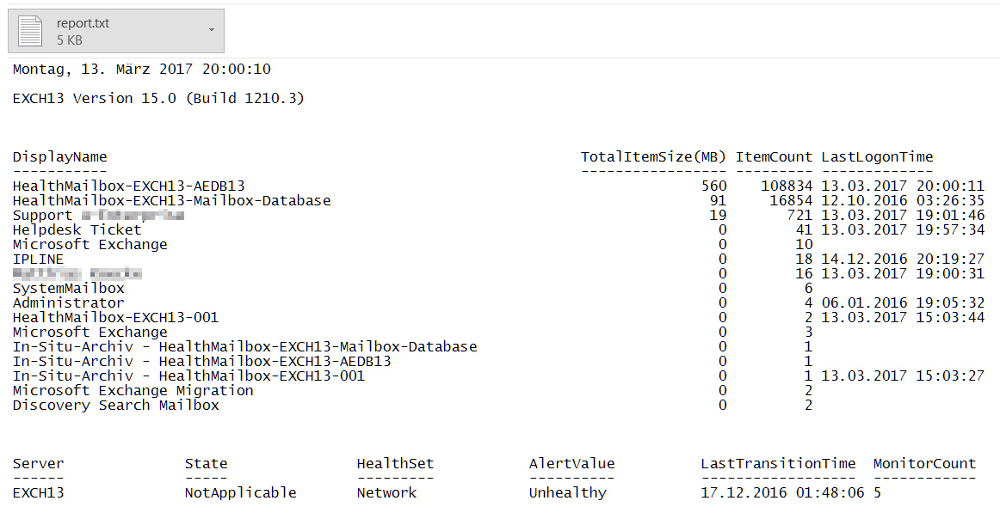

# MailboxStatistics
A powershell script to generate MS Exchange mailbox statistics and health report will sending per email.

[](https://github.com/donkey/MailboxStatistics)
[](https://github.com/donkey/MailboxStatistics/issues)
[](https://github.com/donkey/MailboxStatistics)
[](https://github.com/donkey/MailboxStatistics/network)
[](https://github.com/donkey/MailboxStatistics/stargazers)
[](https://raw.githubusercontent.com/donkey/MailboxStatistics/master/LICENSE)
[](https://github.com/donkey/MailboxStatistics)

## Installation
It requires that the script is executed in the Exchange management shell ``exshell.psc1``.

## Usage:
Ran on exchange host as a task scheduled job at your desired time and action prog *powershell.exe*<br>
use ``example`` param:
```sh
-psconsolefile "C:\Program Files\Microsoft\Exchange Server\V15\Bin\exshell.psc1" -file "C:\windows\system32\MailboxStatistics-Report.ps1"
```
## References
* [Source](http://think.unblog.ch/winstat-user-status/)
---
Screenshot:

